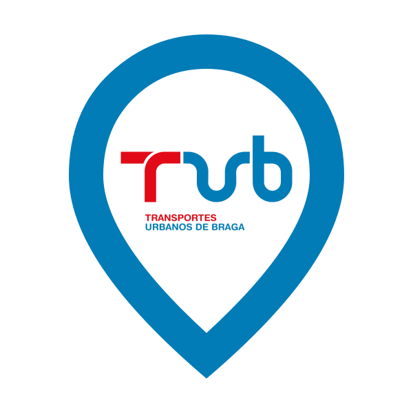

<!-- PROJECT LOGO -->
<br />
<div align="center">
  <a href="https://github.com/darguima/TUB-Bus-Tracker">
    
  </a>

  <h3 align="center">TUB Bus Tracker</h3>

  <p align="center">
    Simple Web App to track TUB buses in real-time, using their scraped API. 
    <br />
    <br />
    <a href="#-demo">View Demo</a>
    &middot;
    <a href="#-getting-started-with-development">Start Developing</a>
  </p>

<h4 align="center">
⭐ Don't forget to Starring ⭐
</h4>

  <div align="center">

[![JavaScript][JavaScript-badge]][JavaScript-url]

  </div>
</div>


<!-- TABLE OF CONTENTS -->
<details>
  <summary>📋 Table of Contents</summary>

## 📋 Table of Contents

- [About The Project](#-about-the-project)
- [Getting Started with Development](#-getting-started-with-development)
- [Contributing](#-contributing)
- [Developed by](#-developed-by)
</details>


## 🔍 About The Project

### 🎯 The goal

#### What's TUB?

[TUB](https://tub.pt/) (`Transportes Urbanos de Braga`) is the public Bus company of Braga, Portugal.

#### The history

At the start of 2024, TUB launched a new App where is available the feature of track buses in real-time, however, just one route once. 

The idea here was to join all the routes in one map at once to track all the buses at the same time and on the same map.

### ⚙️ How it works?

Well, with [HTTPToolkit](https://httptoolkit.com/), [F-Droid](https://f-droid.org/), [Aurora Store](https://www.auroraoss.com/) and an Android Emulator I passed all the App traffic over a proxy, found out the API endpoints and now I can just use them. Simple! :)

All this workaround is needed because Android don't allow proxy the traffic from Apps when the PlayStore is available on the system.

The endpoints scraped are:

| Endpoint                                                       | Description                                         |
|----------------------------------------------------------------|-----------------------------------------------------|
| https://mobibus-gateway.ndrive.com/busLocation/${route number} | Returns the location of all the buses on this route. Well, you also need their key, but that you will nee to find out |

### 🎬 Demo

https://github.com/Darguima/FindYourFriendUniversity/assets/49988070/0fe20807-7e11-431b-ae6f-7cd78b0dbf85


## 🚀 Getting Started with Development

To get a local copy up and running follow these simple example steps.

### 1. Prerequisites

Start by installing the following tools:

- [Git](https://git-scm.com/downloads) - Version Control System

### 2. Cloning

Now clone the repository to your local machine. You can do this using Git:

```bash
$ git clone git@github.com:darguima/TUB-Bus-Tracker.git
# or
$ git clone https://github.com/darguima/TUB-Bus-Tracker.git
```

### 3. Serve the files

You can use any HTTP server to serve the files. For example, using Python's built-in HTTP server:

```bash
$ python3 -m http.server
```

And now access `localhost:8000`.


## 🤝 Contributing

Contributions are what make the open source community such an amazing place to learn, inspire, and create. Any contributions you make are **greatly appreciated**.

If you have a suggestion that would make this better, please fork the repo and create a pull request. You can also simply open an issue with the tag "enhancement".
Don't forget to give the project a star! Thanks again!

1. Fork the Project
2. Create your Feature Branch (`git checkout -b feature/AmazingFeature`)
3. Commit your Changes (`git commit -m 'Add some AmazingFeature'`)
4. Push to the Branch (`git push origin feature/AmazingFeature`)
5. Open a Pull Request


## 👨‍💻 Developed by

- [Darguima](https://github.com/darguima)


<!-- MARKDOWN LINKS & IMAGES -->
<!-- https://www.markdownguide.org/basic-syntax/#reference-style-links -->
[project-thumbnail]: ./logo.svg

[JavaScript-badge]: https://img.shields.io/badge/JavaScript-F7DF1E?style=for-the-badge&logo=javascript&logoColor=black
[JavaScript-url]: https://developer.mozilla.org/en-US/docs/Web/JavaScript
